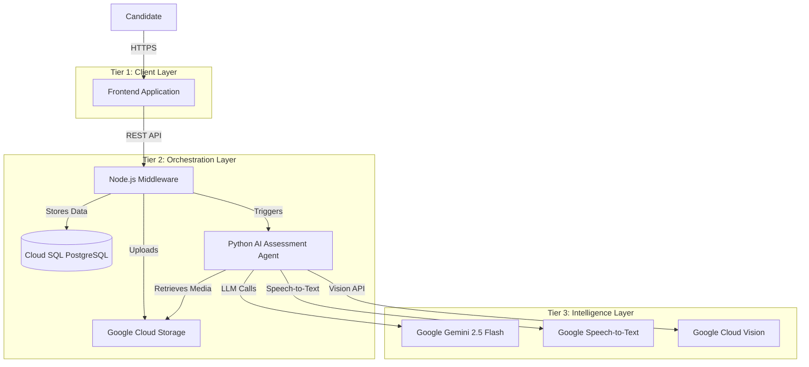

# Video Interview Assessment System: Comprehensive Technical Documentation

**Version:** 2.4.0
**Last Updated:** November 28, 2025
**Authors:** Rakshit Jain ([@raksidehigh](https://github.com/raksidehigh)), Hitesh Joshi ([@thehiteshjoshi](https://github.com/thehiteshjoshi))
**Interview Type:** Full Stack Developer Technical Assessment

**🌐 Live Application:** https://interview-frontend-wm2yb4fdna-uc.a.run.app/

---

## 1. Executive Summary

The **Video Interview Assessment System** is a state-of-the-art, AI-powered platform designed to automate technical screening interviews for Full Stack Developer positions. By leveraging a sophisticated multi-agent architecture, the system evaluates candidates on their technical knowledge, problem-solving approach, system design thinking, and communication skills.

Traditional hiring processes are often bottlenecked by the manual review of initial screening videos. This system eliminates that bottleneck by providing instant, objective, and deep analysis of candidate responses. It employs a **3-Tier Architecture** comprising a responsive Frontend, a robust Node.js Middleware, and a high-performance Python AI Assessment Agent.

### Deployed Services
*   **Frontend:** https://interview-frontend-wm2yb4fdna-uc.a.run.app/
*   **Backend API:** https://interview-backend-wm2yb4fdna-uc.a.run.app
*   **Database Admin:** https://interview-backend-wm2yb4fdna-uc.a.run.app/admin/database
*   **AI Agent:** https://video-interview-api-wm2yb4fdna-uc.a.run.app

### Key Capabilities
*   **Camera & Microphone Check:** Candidates verify their setup by stating their name and confirming equipment functionality.
*   **Automated Identity Verification:** Uses advanced facial recognition to ensure the candidate in the video matches their profile picture.
*   **Technical Content Evaluation:** Analyzes the semantic depth of answers against specific technical criteria using Large Language Models (Gemini 2.5 Flash).
*   **Behavioral Profiling:** Assesses communication clarity, confidence, and problem-solving approach using psychological markers.
*   **Video Quality Assurance:** Automatically checks for lighting, resolution, and audio clarity to ensure assessment validity.
*   **Optimized Performance:** Features a parallel processing pipeline that reduces assessment time from 5 minutes to under 45 seconds per candidate.
*   **Session Management:** Persistent sessions with localStorage, allowing candidates to resume interrupted interviews.
*   **Result Caching:** Instant result retrieval for completed assessments without re-running AI analysis.
*   **Question Hints:** Provides helpful hints for each technical question to guide candidate responses.

### Interview Questions (Full Stack Developer)
Each question includes helpful hints to guide candidates:

1. **System Design:** Design a Video Streaming Platform Like YouTube
   - *Hints: Upload/storage/CDN, database design, scalability, video transcoding*
2. **Architecture:** Explain the Trade-offs Between Monolithic vs Microservices Architecture
   - *Hints: Simplicity vs complexity, deployment differences, team size impact*
3. **Security:** How Would You Handle Authentication and Authorization in a Full Stack Application?
   - *Hints: Auth vs AuthZ difference, JWT/OAuth, security best practices, RBAC*
4. **Performance:** Describe Your Approach to Optimizing the Performance of a Slow Web Application
   - *Hints: Measuring/profiling, caching, database optimization, frontend optimization*
5. **Real-time Systems:** How Would You Design a Real-time Notification System?
   - *Hints: WebSockets/SSE, message queues, scalability, offline handling*

### Business Value
*   **90% Reduction in Screening Time:** Recruiters receive a finalized report with Pass/Fail recommendations instantly.
*   **Standardized Evaluation:** Removes human bias by applying consistent scoring rubrics across all candidates.
*   **Scalability:** Built on Google Cloud Run (Serverless), the system can handle thousands of concurrent interviews without performance degradation.

---

## 2. System Architecture (Deep Dive)

The system follows a **Microservices-based 3-Tier Architecture**, ensuring separation of concerns, scalability, and maintainability.

### 2.1 High-Level Architecture Diagram



### 2.2 Component Breakdown

#### Tier 1: Frontend (Client Layer)
*   **Location:** `interview-frontend-app/frontend/`
*   **Port:** 3000
*   **Technology:** HTML5, CSS3, Vanilla JavaScript (ES6+)
*   **Responsibility:**
    *   **User Interface:** Provides a clean, responsive interface for candidates to enter details and record videos.
    *   **Media Capture:** Utilizes the browser's `MediaRecorder` API to capture video and audio streams.
    *   **State Management:** Manages the interview flow (Profile -> Instructions -> Questions 1-5 -> Submission).
    *   **Data Transmission:** Sends `FormData` payloads (videos, images, text) to the Middleware.
*   **Key Files:**
    *   `index.html`: The main entry point and layout structure.
    *   `script.js`: Handles logic for camera access, recording timers (10s minimum), and API calls.
    *   `style.css`: Contains the visual styling and responsive design rules.

#### Tier 2: Middleware (Orchestration Layer)
*   **Location:** `interview-frontend-app/backend/`
*   **Port:** 8080
*   **Technology:** Node.js, Express.js
*   **Responsibility:**
    *   **API Gateway:** Acts as the single entry point for the frontend, preventing direct exposure of the AI Agent.
    *   **File Management:** Receives multipart file uploads (videos, images) and streams them directly to Google Cloud Storage (GCS) using `@google-cloud/storage`.
    *   **Data Persistence:** Stores user metadata and assessment results in Cloud SQL (PostgreSQL) for persistent, scalable storage.
    *   **Service Orchestration:** Formats the assessment request and calls the Python AI Agent.
*   **Key Files:**
    *   `server.js`: The Express server definition, route handlers (`/submit-interview`, `/upload-video`), and GCS integration logic.
    *   `db.js`: PostgreSQL database connection and operations module.
    *   `package.json`: Dependency definitions (`multer`, `axios`, `pg`).

#### Tier 3: AI Assessment Agent (Intelligence Layer)
*   **Location:** `app/` (Root Directory)
*   **Port:** 8000
*   **Technology:** Python 3.11, FastAPI, LangGraph, Google Gemini
*   **Responsibility:**
    *   **Core Logic:** Executes the multi-agent workflow to analyze the interview.
    *   **AI Processing:** Interfaces with Google Gemini models for content and behavioral analysis.
    *   **Computer Vision:** Uses OpenCV and MediaPipe for face detection and quality analysis.
    *   **Workflow Management:** Uses LangGraph to orchestrate the 6-step assessment pipeline (Identity -> Quality -> Transcription -> Content -> Behavioral -> Decision).
*   **Key Files:**
    *   `app/main.py`: FastAPI entry point and endpoint definitions.
    *   `app/agents/graph_optimized.py`: The optimized, parallel execution graph.
    *   `app/agents/nodes/*.py`: Individual agent logic (Identity, Quality, etc.).

### 2.3 Data Flow

1.  **Initiation:** The user opens the Frontend and enters their details.
2.  **Capture:** The user records a profile picture and 5 video responses.
3.  **Upload:**
    *   As each video is recorded, the Frontend calls `POST /upload-video` on the Middleware.
    *   The Middleware streams the video to GCS bucket `virtual-interview-agent` under the path `user_id/interview_videos/`.
4.  **Submission:**
    *   Once all videos are uploaded, the Frontend calls `POST /submit-interview`.
    *   The Middleware saves the user record to Cloud SQL (PostgreSQL).
    *   The Middleware triggers the AI Agent via `POST /api/v1/assess`.
5.  **Assessment:**
    *   The AI Agent downloads the media from GCS.
    *   It runs the 6-agent pipeline (Identity, Quality, Transcription, Content, Behavioral, Decision).
    *   It returns a comprehensive JSON object with scores and reasoning.
6.  **Result:** The Middleware stores the result and returns it to the Frontend for display.

---

## 3. Component Analysis

### 3.1 Frontend Application
The frontend is designed to be lightweight and dependency-free (Vanilla JS), ensuring fast load times and broad compatibility.

*   **Media Recording Logic (`script.js`):**
    *   **Constraint Enforcement:** The `stopRecording` function checks `recordedChunks` duration. If the video is < 10 seconds, it alerts the user and prevents submission.
    *   **Chunk Handling:** Video data is captured in 1-second chunks (`timeslice: 1000`) to ensure data safety.
    *   **Sequential Uploads:** The `nextVideoStep` function ensures the current video is successfully uploaded (awaiting the 200 OK response) before unlocking the next question.

### 3.2 Node.js Middleware
The middleware serves as the "glue" between the user and the AI.

*   **Storage Strategy:**
    *   It uses `multer` for handling `multipart/form-data`.
    *   Files are NOT stored locally on the container (which is ephemeral). Instead, they are streamed directly to GCS using `blob.createWriteStream()`.
    *   **Naming Convention:** Files are stored as `[user_id]/[file_type]/[filename]`.
        *   Example: `user_123/interview_videos/video_1.webm`
*   **Database Schema (Cloud SQL PostgreSQL):**
    *   `users`: Stores `id`, `name`, `email`, `dob`, `created_at`.
    *   `assessments`: Stores `id`, `user_id`, `result` (JSONB), `gcs_path`, `created_at`.
    *   **Indexes:** Email and user_id indexed for fast lookups.
    *   **Connection:** Via Cloud SQL Proxy for secure, low-latency access from Cloud Run.

### 3.3 Python AI Agent (The Core)
This is the most complex component, built on **LangGraph**.

*   **Optimization Strategy:**
    *   **Original Flow:** Sequential execution (Agent 1 -> Agent 2 -> ... -> Agent 6). Time: ~4-5 minutes.
    *   **Optimized Flow:**
        *   **Phase 1 (Prep):** Parallel download of all assets.
        *   **Phase 2 (Parallel):** Runs Identity, Quality, and Transcription concurrently using `asyncio.gather`.
        *   **Phase 3 (Sequential):** Runs Content and Behavioral analysis (dependent on transcripts).
        *   **Phase 4 (Aggregation):** Combines scores.
    *   **Result:** Processing time reduced to **30-45 seconds**.

---

## 4. Agentic Workflow & Logic (Deep Dive)

The core intelligence of the system resides in its 6-agent workflow. Each agent is a specialized node in the LangGraph network.

### 4.1 Agent 1: Identity Verification
**Goal:** Verify candidate identity through facial recognition and equipment check.

*   **Technology Stack:**
    *   **MediaPipe Face Detection:** Used first to robustly extract face crops from images (handling rotation/lighting better than dlib).
    *   **face_recognition (dlib):** Generates 128-dimensional face encodings for comparison.
    *   **Euclidean Distance:** Measures similarity between encodings.
*   **Process:**
    1.  **Camera Check:** Candidate records a video stating: "My name is [Name]. My camera and microphone are working properly. I am ready to begin the interview."
    2.  **Extraction:** The agent extracts the face from the Profile Picture and the *best* frame from the camera check video.
    3.  **Comparison:** It compares the Profile Picture encoding against the Video Frame encoding.
    4.  **Thresholding:**
        *   **Distance Threshold:** `0.6` (Lower is better).
        *   **Similarity Score:** Calculated as `100 - (distance * 100)`.
*   **Pass Criteria:**
    *   Face similarity ≥ **60%**
    *   Minimum 15 seconds recording
*   **Output:** `verified` (Boolean), `confidence` (0-100%).

### 4.2 Agent 2: Video Quality Assurance
**Goal:** Ensure the video is technically sound for AI analysis.

*   **Technology Stack:** OpenCV (`cv2`), NumPy.
*   **Metrics Analyzed:**
    1.  **Resolution:** Checks width/height (Target: 720p+).
    2.  **FPS:** Checks frame rate (Target: 24fps+).
    3.  **Brightness:** Calculates average pixel intensity (0-255). Ideal range: 80-180.
    4.  **Sharpness:** Uses Laplacian Variance to detect blur.
    5.  **Face Visibility:** Checks what % of the video contains a detectable face.
*   **Scoring Formula:**
    ```python
    Quality Score = (Resolution_Score * 0.25) + 
                    (FPS_Score * 0.15) + 
                    (Brightness_Score * 0.20) + 
                    (Sharpness_Score * 0.20) + 
                    (Face_Visibility_Score * 0.20)
    ```
*   **Pass Threshold:** Overall Score >= **60/100**.

### 4.3 Agent 3: Audio Transcription
**Goal:** Convert speech to text for NLP analysis.

*   **Technology Stack:** Google Cloud Speech-to-Text API (v2).
*   **Process:**
    1.  Extracts audio track from video.
    2.  Uploads to GCS (if not already there).
    3.  Triggers `LongRunningRecognize` operation for high accuracy.
    4.  Returns full transcript with timestamps.
*   **Optimization:** Runs in parallel with Identity and Quality checks to minimize latency.

### 4.4 Agent 4: Technical Content Evaluation
**Goal:** Assess the *correctness* and *depth* of the candidate's technical answers.

*   **Technology Stack:** Google Gemini 2.5 Flash.
*   **Input:** Transcripts + Question Context + Technical Criteria.
*   **Logic:**
    *   The agent evaluates each answer against specific **Technical Components**, **Clarity**, and **Depth**.
    *   **Question-Specific Evaluation:**
        *   **Q1 (System Design):** Architecture components (upload, storage, CDN, database), scalability
        *   **Q2 (Architecture):** Comparison of monolithic vs microservices, trade-offs, context awareness
        *   **Q3 (Auth/AuthZ):** Distinction between authentication/authorization, JWT/sessions, security practices
        *   **Q4 (Performance):** Systematic approach (measure → optimize), multi-layer optimization
        *   **Q5 (Real-time):** Technology choice (WebSockets/SSE), architecture, reliability
    *   **Scoring:** 0-100 scale per question, pass threshold: 60/100.
*   **Weightage:** Contributes **70%** to the Final Score.

### 4.5 Agent 5: Behavioral Analysis
**Goal:** Evaluate communication skills and problem-solving approach.

*   **Technology Stack:** Google Gemini 2.5 Flash.
*   **Input:** Transcripts + Tone/Sentiment Analysis.
*   **Dimensions Analyzed:**
    1.  **Communication Clarity:** Is the candidate articulate?
    2.  **Confidence:** Do they speak with conviction?
    3.  **Structure:** Is the answer logically organized?
    4.  **Problem-Solving Approach:** Systematic vs intuitive thinking
*   **Weightage:** Contributes **30%** to the Final Score.

### 4.6 Agent 6: Decision Aggregation
**Goal:** Synthesize all data into a final hiring recommendation.

*   **Formula:**
    ```python
    Final Score = (Content_Score * 0.70) + (Behavioral_Score * 0.30)
    ```
*   **Decision Logic:**
    *   **PASS:** Final Score >= **70** AND Identity Verified AND Quality Passed.
    *   **REVIEW:** Final Score between **50-70** OR Identity/Quality Warning.
    *   **FAIL:** Final Score < **50**.
*   **Output:** Generates a human-readable "Reasoning" paragraph explaining the decision.

---

## 5. Installation & Setup (Step-by-Step)

### 5.1 Prerequisites
Before running the system locally, ensure you have the following installed:
*   **Python 3.11+** (for AI Agent)
*   **Node.js 18+** (for Middleware)
*   **Docker** (optional, for containerized testing)
*   **Google Cloud SDK** (`gcloud`)
*   **FFmpeg** (required for audio extraction)

### 5.2 Environment Configuration
You need to configure environment variables for both the Backend and Middleware.

1.  **AI Agent (`app/.env`):**
    ```bash
    GOOGLE_API_KEY=your_gemini_api_key
    GOOGLE_APPLICATION_CREDENTIALS=path/to/service-account.json
    GCS_BUCKET_NAME=virtual-interview-agent
    USE_OPTIMIZED=true
    ```

2.  **Middleware (`interview-frontend-app/backend/.env`):**
    ```bash
    PORT=8080
    ASSESSMENT_API_URL=http://localhost:8000/api/v1/assess
    GOOGLE_APPLICATION_CREDENTIALS=path/to/service-account.json
    ```

### 5.3 Local Development
To start the entire stack locally, use the provided helper script:

```bash
cd interview-frontend-app
./start-local.sh
```

This script performs the following actions:
1.  Starts the **Python AI Agent** on `http://localhost:8000`.
2.  Starts the **Node.js Middleware** on `http://localhost:8080`.
3.  Starts the **Frontend** on `http://localhost:3000`.

**Access the Application:** Open your browser and navigate to `http://localhost:3000`.

---

## 6. Deployment Guide

The system is designed to be deployed on **Google Cloud Run** as three separate services.

### 6.1 Deploying the AI Agent
Use the `deploy_new.sh` script to deploy the Python backend.

```bash
./deploy_new.sh
```
*   **Service Name:** `video-interview-api`
*   **URL:** https://video-interview-api-wm2yb4fdna-uc.a.run.app
*   **Configuration:** 2 CPUs, 4GB Memory (Required for Face Recognition).
*   **Concurrency:** 80 (High concurrency allowed due to async I/O).

### 6.2 Setting Up Cloud SQL (PostgreSQL)
Before deploying the backend, set up the database:

```bash
# 1. Enable Cloud SQL API
gcloud services enable sqladmin.googleapis.com --project=interview-agent-479316

# 2. Create PostgreSQL instance (takes 5-10 minutes)
gcloud sql instances create interview-db \
  --database-version=POSTGRES_15 \
  --tier=db-f1-micro \
  --region=us-central1 \
  --storage-type=SSD \
  --storage-size=10GB \
  --project=interview-agent-479316

# 3. Set database password
gcloud sql users set-password postgres \
  --instance=interview-db \
  --password=YOUR_SECURE_PASSWORD \
  --project=interview-agent-479316

# 4. Create database
gcloud sql databases create interview_db \
  --instance=interview-db \
  --project=interview-agent-479316
```

*   **Instance Name:** `interview-db`
*   **Database:** `interview_db`
*   **Connection:** Automatic via Cloud SQL Proxy from Cloud Run

### 6.3 Deploying the Backend
Use the `deploy-backend.sh` script.

```bash
cd interview-frontend-app
./deploy-backend.sh
```
*   **Service Name:** `interview-backend`
*   **URL:** https://interview-backend-wm2yb4fdna-uc.a.run.app
*   **Configuration:** 2 CPUs, 2GB Memory.
*   **Database:** Connected to Cloud SQL PostgreSQL via Unix socket.
*   **Environment Variables:** `ASSESSMENT_API_URL`, `BUCKET_NAME`, `DB_USER`, `DB_PASSWORD`, `DB_NAME`, `DB_HOST`

### 6.4 Deploying the Frontend
Use the `deploy-frontend.sh` script.

```bash
cd interview-frontend-app
./deploy-frontend.sh
```
*   **Service Name:** `interview-frontend`
*   **URL:** https://interview-frontend-wm2yb4fdna-uc.a.run.app/
*   **Configuration:** 1 CPU, 512MB Memory (Python http.server).

### 6.5 Deploy All Services
Use the `deploy-all.sh` script to deploy everything at once.

```bash
cd interview-frontend-app
./deploy-all.sh
```
This script will:
1. Deploy the backend
2. Update frontend with backend URL
3. Deploy the frontend
4. Display all service URLs

---

## 7. API Reference

### 7.1 AI Agent Endpoints

#### `POST /api/v1/assess`
Triggers the full assessment pipeline.

**Request Body:**
```json
{
  "user_id": "user_12345",
  "username": "John Doe",
  "bucket_name": "virtual-interview-agent"
}
```

**Response Body:**
```json
{
  "user_id": "user_12345",
  "decision": "PASS",
  "final_score": 85.5,
  "component_scores": {
    "identity": 100.0,
    "quality": 90.0,
    "content": 82.0,
    "behavioral": 88.0,
    "transcription": 95.0
  },
  "reasoning": "Candidate demonstrated strong technical knowledge...",
  "processing_time_seconds": 42.5
}
```

### 7.2 Middleware Endpoints

#### `POST /upload-video`
Uploads a single video chunk or file.
*   **Form Data:** `video` (File), `user_id` (String), `index` (Integer).

#### `POST /submit-interview`
Finalizes the interview and triggers assessment.
*   **Form Data:** `user_id`, `username`, `email`.

---

## 8. Troubleshooting & Maintenance

### 8.1 Common Issues

| Issue | Probable Cause | Solution |
| :--- | :--- | :--- |
| **Memory Limit Exceeded** | Face recognition is memory-intensive. | Increase Cloud Run memory to 4GB or 8GB. |
| **Face Not Detected** | Poor lighting or extreme angles. | Ensure the candidate faces the camera directly with good lighting. |
| **GCS Permission Denied** | Service Account missing roles. | Grant `Storage Object Admin` and `Storage Object Creator` roles. |
| **Upload Timeout** | Slow internet connection. | The frontend handles retries, but ensure a stable connection (>5Mbps). |

### 8.2 Logging & Monitoring
The system integrates with **Google Cloud Logging**.
*   **Filter:** `resource.type="cloud_run_revision" AND severity>=WARNING`
*   **Key Metrics:** Look for "Processing time" logs to monitor performance.

---

## 9. Security Best Practices

1.  **Least Privilege Access:** The Service Account used by Cloud Run has only the permissions strictly necessary (GCS access, Vertex AI User).
2.  **Ephemeral Storage:** No sensitive candidate data is stored permanently on the application servers. All data resides in secure GCS buckets.
3.  **Signed URLs:** Video streaming uses short-lived Signed URLs to prevent unauthorized access to raw video files.
4.  **Input Validation:** The Middleware validates all file types and sizes before processing.

---

## 10. Future Roadmap

*   **Async Webhooks:** Decouple the assessment from the HTTP request to handle even higher loads.
*   **Real-time Feedback:** Provide instant feedback to candidates during the interview (e.g., "Please speak louder").
*   **Multi-language Support:** Add support for non-English interviews using Gemini's multilingual capabilities.
*   **Fraud Detection:** Enhance identity verification with liveness detection (blinking/movement checks).

---

## 11. Data Models & Schemas (TypedDict Spec)

### 11.1 InterviewState Schema
The core data structure passed through all agents in the LangGraph workflow is defined in `app/agents/state.py`:

```python
class InterviewState(TypedDict):
    # INPUT (Required)
    user_id: str
    username: str  
    profile_pic_url: str  # gs://bucket/user_id/profile_pic.jpg
    video_urls: List[str]  # [video_1.webm, ..., video_5.webm]
    interview_questions: List[Dict]  # 5 hardcoded questions
    
    # AGENT OUTPUTS
    identity_verification: Optional[Dict]  # Agent 1
    video_quality: Optional[Dict]  # Agent 2
    transcriptions: Optional[Dict]  # Agent 3
    content_evaluation: Optional[Dict]  # Agent 4
    behavioral_analysis: Optional[Dict]  # Agent 5
    final_decision: Optional[Dict]  # Agent 6
    
    # CONTROL FLOW
    should_continue: bool
    current_stage: str
    errors: List[str]
```

### 11.2 Google Cloud Storage (GCS) Bucket Structure

The system expects the following file structure in the `virtual-interview-agent` bucket:

```
gs://virtual-interview-agent/
├── user_123/
│   ├── profile_images/
│   │   └── profile_pic.jpg
│   └── interview_videos/
│       ├── video_0.webm  # Optional identity check
│       ├── video_1.webm  # Question 1
│       ├── video_2.webm  # Question 2
│       ├── video_3.webm  # Question 3
│       ├── video_4.webm  # Question 4
│       └── video_5.webm  # Question 5
└── temp_transcriptions/
    └── user_123/
        └── <uuid>.flac  # Temporary audio files (auto-deleted)
```

---

## 12. Prompt Engineering & LLM Configuration

### 12.1 Model Selection
*   **Content Evaluation (Agent 4):** `gemini-2.5-flash-exp` (Temperature: 0.3)
*   **Behavioral Analysis (Agent 5):** `gemini-2.5-flash` (Temperature: 0.3)
*   **Decision Reasoning (Agent 6):** `gemini-2.5-flash` (Temperature: 0.3)

### 12.2 Evaluation Philosophy: "Technical Depth Assessment"
The prompts are optimized for **technical competency evaluation**. Key principles:
*   **Pass Threshold:** 60/100 per question (balanced for technical assessment)
*   **Focus on Understanding:** Evaluate conceptual understanding, not perfect recall
*   **Systematic Thinking:** Reward structured, logical approaches to problems
*   **Technical Depth:** Bonus points for discussing trade-offs, scalability, and best practices

### 12.3 Content Evaluation Prompts (Agent 4 - `content.py`)

#### Question 1: "How would you design a Video Streaming Platform Like YouTube."
**Evaluation Criteria:**
- Must mention key components: upload, processing/transcoding, storage (S3/GCS), CDN, database
- Should discuss scalability and latency considerations
- Structured approach: requirements → high-level design → components

**Scoring Logic:**
```python
# Technical Content (70%)
content_score = min(70, technical_depth * 0.7)

# Clarity (20%)
clarity_score = 20 if not excessive_fillers else 10

# Communication (10%)
communication_score = 10 if sentiment != 'negative' else 5

# Pass threshold: 60/100
overall_passed = score >= 60
```

#### Question 2: "Explain the Trade-offs Between Monolithic vs Microservices Architecture"
**Evaluation Criteria:**
- Must compare both architectures
- Should discuss: simplicity, deployment, scaling, complexity, team size, maintenance
- Context-dependent reasoning (choice depends on situation)

#### Question 3: "How Would You Handle Authentication and Authorization in a Full Stack Application?"
**Evaluation Criteria:**
- Must distinguish between authentication (who) and authorization (what)
- Should mention: JWT, sessions, OAuth, RBAC, security best practices
- Security-conscious approach (HTTPS, token storage)

#### Question 4: "Describe Your Approach to Optimizing the Performance of a Slow Web Application"
**Evaluation Criteria:**
- Must describe systematic approach: Measure → Identify → Optimize
- Should mention: profiling, caching, database indexing, bundle size, CDN, lazy loading
- Multi-layer optimization (frontend, backend, database)

#### Question 5: "How Would You Design a Real-time Notification System?"
**Evaluation Criteria:**
- Must choose appropriate technology: WebSockets, Socket.io, SSE, or polling
- Should discuss: concurrency, message queues (Redis/Kafka), reliability
- Architectural components and scalability considerations

**Scoring Logic (from `content.py`):**
```python
# Technical Content (70%)
content_score = min(70, technical_depth * 0.7)

# Clarity (20%)
clarity_score = 20 if not excessive_fillers else 10

# Communication (10%)
communication_score = 10 if sentiment != 'negative' else 5

# Pass threshold: 60/100
overall_passed = score >= 60 or llm_passed
```

### 12.4 Behavioral Analysis Prompt (Agent 5 - `behavioral.py`)
```
You are an expert behavioral analyst evaluating a Full Stack Developer technical interview.

EVALUATION FOCUS:
- Communication clarity and articulation
- Confidence in technical explanations
- Problem-solving approach (systematic vs. intuitive)
- Engagement and enthusiasm for technical topics
- Stress management during technical questions

SCORING GUIDELINES:
- **Base score: 70/100** (neutral baseline)
- **75-80**: Adequate communication, answers questions
- **80-85**: Clear communication, shows confidence
- **85-90**: Strong technical communication, systematic thinking
- **90+**: Exceptional clarity, confidence, and problem-solving approach

BEHAVIORAL INDICATORS:
- Positive: Clear explanations, structured thinking, technical curiosity, confidence
- Neutral: Some filler words, minor nervousness (normal in interviews)
- Negative: Excessive confusion, inability to articulate, defensive tone
```

---

## 13. GCS Storage & Workspace Management

### 13.1 Signed URL Generation (`gcs_streaming.py`)
The system uses **signed URLs** to stream videos directly from GCS without downloading:

```python
def get_signed_url(gcs_url: str, expiration_minutes: int = 60) -> str:
    """
    Generate signed URL for direct GCS access
    
    Example:
        signed_url = get_signed_url("gs://bucket/video.mp4")
        cap = cv2.VideoCapture(signed_url)  # Stream directly! NO DOWNLOAD!
    """
    storage_client = storage.Client()
    bucket, blob_path = parse_gcs_url(gcs_url)
    blob = bucket.blob(blob_path)
    
    signed_url = blob.generate_signed_url(
        version="v4",
        expiration=datetime.timedelta(minutes=expiration_minutes),
        method="GET"
    )
    return signed_url
```

**Memory Impact:** ✅ **Zero** - Videos are streamed, never stored on disk.

### 13.2 Workspace Isolation (`workspace.py`)
Each user gets an **isolated temporary workspace** to prevent file conflicts:

```python
class UserWorkspace:
    def __init__(self, user_id: str):
        # Create unique workspace
        self.workspace = tempfile.gettempdir() / f"video_assessments/{user_id}_{timestamp}/"
        self.videos_dir = self.workspace / "videos"
        self.audios_dir = self.workspace / "audios"
    
    def cleanup(self) -> Dict:
        """MANDATORY cleanup with verification"""
        shutil.rmtree(self.workspace)  # Delete ALL files
        verify_deletion(self.workspace)  # Ensure deleted
        gc.collect()  # Force garbage collection
        return {"deleted": True, "verified": True, "files_deleted": count}
```

**Cleanup Flow:**
1.  **Phase 1:** Download files to workspace
2.  **Phase 2-3:** Process assessment
3.  **Phase 4:** **MANDATORY** workspace deletion before response

**Safety Check:** `verify_cleanup_before_response()` blocks the API response if cleanup fails:
```python
if not cleanup_report.get("verified"):
    raise RuntimeError("CRITICAL: Workspace deletion failed")
```

---

## 14. Performance Optimization & Memory Management

### 14.1 Memory Usage Breakdown (from `LOGGING_MEMORY_IMPLICATIONS.md`)

| Component | Memory per Request | Notes |
| :--- | :--- | :--- |
| **In-Memory Logging** | 14 MB | Python logging buffers |
| **Application State** | 2-5 MB | InterviewState object |
| **Face Recognition** | 300-500 MB | dlib face encodings |
| **Video Frame Buffers** | 50-100 MB | OpenCV processing |
| **Total per Request** | **~400-650 MB** | **Peak memory** |

**Concurrent Requests:**
*   1 request: ~650 MB
*   10 concurrent: ~6.5 GB
*   **Cloud Run Config:** 4 GB memory → Safe for ~6 concurrent requests

### 14.2 Optimization Strategies

#### 1. Video Streaming (No Download)
```python
# ❌ OLD (Downloads 50 MB × 5 = 250 MB)
video_path = download_from_gcs(gcs_url)
cap = cv2.VideoCapture(video_path)

# ✅ NEW (Streams directly, 0 MB overhead)
signed_url = get_signed_url(gcs_url)
cap = cv2.VideoCapture(signed_url)  # Streams!
```

**Memory Saved:** 250 MB per request

#### 2. Parallel Execution (`graph_optimized.py`)
```python
# Agents 1, 2, 3 run CONCURRENTLY
identity_state, quality_state, transcribe_state = await asyncio.gather(
    verify_identity_parallel(resources, state),
    check_quality_parallel(resources, state),
    transcribe_videos_parallel(resources, state)
)
```

**Time Saved:** 4-5 minutes → 30-45 seconds (**90% faster**)

#### 3. Mandatory Workspace Cleanup
```python
# BEFORE sending response:
cleanup_report = workspace.cleanup()
verify_cleanup_before_response(cleanup_report)  # Blocks if failed
```

Prevents memory leaks and disk exhaustion.

---

## 15. Speech-to-Text Configuration (`transcribe.py`)

### 15.1 Google Cloud Speech-to-Text V2 (Chirp 3)
```python
config = cloud_speech.RecognitionConfig(
    auto_decoding_config=cloud_speech.AutoDetectDecodingConfig(),
    language_codes=["auto"],  # Auto-detect language
    model="chirp_3",  # Latest Chirp model
    features=cloud_speech.RecognitionFeatures(
        enable_automatic_punctuation=True
    ),
    denoiser_config=cloud_speech.DenoiserConfig(
        denoise_audio=True,
        snr_threshold=20.0  # Medium sensitivity
    )
)
```

### 15.2 Synchronous vs. Batch Recognition
*   **Short audio (< 60s):** `recognize()` (synchronous)
*   **Long audio (≥ 60s):** `batch_recognize()` (long-running operation)

```python
duration = get_audio_duration(audio_path)

if duration >= 60:
    # Upload to GCS for batch
    temp_gcs_uri = upload_audio_to_gcs(audio_path, user_id)
    operation = client.batch_recognize(request)
    response = operation.result(timeout=300)  # 5min timeout
else:
    # Synchronous for short audio
    response = client.recognize(request)
```

### 15.3 Transcription Output
```python
{
  "transcript": "Full text of the answer...",
  "confidence": 0.95,  # 95% confidence
  "word_count": 127,
  "speaking_rate": 152.5,  # Words per minute
  "filler_words": 8,  # "um", "uh", "like" count
  "detected_language": "en-US",
  "word_timestamps": [  # Word-level timing
    {"word": "Hello", "start_time": 0.0, "end_time": 0.5},
    ...
  ]
}
```

---

## 16. Codebase Module Guide

### 16.1 Main Application
*   **`app/main.py`**: FastAPI entry point, `/api/v1/assess` endpoint, file discovery logic.

### 16.2 Agent Nodes (`app/agents/nodes/`)
*   **`identity.py`**: MediaPipe + face_recognition (dlib). Threshold: 0.6 Euclidean distance.
*   **`quality.py`**: OpenCV quality analysis (Resolution, FPS, Brightness, Sharpness, Face Visibility).
*   **`transcribe.py`**: Speech-to-Text V2 with Chirp 3, auto language detection.
*   **`content.py`**: LLM content evaluation with MVP-optimized prompts.
*   **`behavioral.py`**: Gemini behavioral profiling (engagement, confidence).
*   **`aggregate.py`**: Final decision (70% Content + 30% Behavioral).

### 16.3 Utilities (`app/utils/`)
*   **`gcs_streaming.py`**: Signed URL generation for streaming.
*   **`workspace.py`**: Isolated workspace with mandatory cleanup.
*   **`speech_client.py`**: Singleton Speech-to-Text client.
*   **`parallel.py`**: Parallel task manager.

### 16.4 State Management
*   **`app/agents/state.py`**: TypedDict definitions (`InterviewState`, `VideoAnalysis`).
*   **`app/agents/graph_optimized.py`**: 4-Phase optimized workflow (Prep → Parallel → Aggregate → Cleanup).

---

**End of Comprehensive Technical Documentation**

For questions or contributions, please refer to the source code in the `app/` directory or contact the project maintainers.
